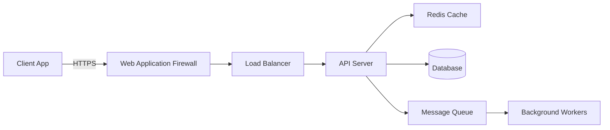

## Overview

This template helps Aegis implement comprehensive security measures following OWASP best practices and defense-in-depth principles.

## Security Configuration (src/security/config.ts)

```typescript
/**
 * Security Configuration
 * Centralized security settings following principle of least privilege
 * 
 * @module security/config
 * @author Aegis (Security Engineer)
 */

export const securityConfig = {
  // JWT Configuration
  jwt: {
    secret: process.env.JWT_SECRET || generateSecureSecret(),
    expiresIn: '15m', // Short-lived access tokens
    refreshExpiresIn: '7d',
    algorithm: 'HS256' as const,
    issuer: process.env.APP_NAME || 'secure-app',
    audience: process.env.APP_DOMAIN || 'https://api.example.com'
  },

  // Password Policy
  password: {
    minLength: 12,
    requireUppercase: true,
    requireLowercase: true,
    requireNumbers: true,
    requireSpecialChars: true,
    maxLength: 128,
    bcryptRounds: 12,
    commonPasswordsBlacklist: true,
    previousPasswordsCheck: 5
  },

  // Rate Limiting
  rateLimiting: {
    // General API limits
    api: {
      windowMs: 15 * 60 * 1000, // 15 minutes
      max: 100, // limit each IP to 100 requests per windowMs
      message: 'Too many requests from this IP',
      standardHeaders: true,
      legacyHeaders: false
    },
    // Strict limits for auth endpoints
    auth: {
      windowMs: 15 * 60 * 1000,
      max: 5, // Only 5 auth attempts per 15 minutes
      skipSuccessfulRequests: true
    },
    // Account creation limits
    createAccount: {
      windowMs: 60 * 60 * 1000, // 1 hour
      max: 3 // Max 3 accounts per hour per IP
    }
  },

  // CORS Configuration
  cors: {
    origin: process.env.ALLOWED_ORIGINS?.split(',') || ['https://app.example.com'],
    credentials: true,
    methods: ['GET', 'POST', 'PUT', 'DELETE', 'OPTIONS'],
    allowedHeaders: ['Content-Type', 'Authorization', 'X-Request-ID'],
    exposedHeaders: ['X-Request-ID'],
    maxAge: 86400 // 24 hours
  },

  // Session Configuration
  session: {
    name: 'sessionId',
    secret: process.env.SESSION_SECRET || generateSecureSecret(),
    resave: false,
    saveUninitialized: false,
    cookie: {
      secure: process.env.NODE_ENV === 'production',
      httpOnly: true,
      maxAge: 24 * 60 * 60 * 1000, // 24 hours
      sameSite: 'strict' as const
    }
  },

  // Security Headers
  headers: {
    contentSecurityPolicy: {
      directives: {
        defaultSrc: ["'self'"],
        styleSrc: ["'self'", "'unsafe-inline'"],
        scriptSrc: ["'self'"],
        imgSrc: ["'self'", 'data:', 'https:'],
        connectSrc: ["'self'"],
        fontSrc: ["'self'"],
        objectSrc: ["'none'"],
        mediaSrc: ["'self'"],
        frameSrc: ["'none'"]
      }
    },
    hsts: {
      maxAge: 31536000,
      includeSubDomains: true,
      preload: true
    }
  },

  // Input Validation
  validation: {
    maxPayloadSize: '10mb',
    maxUrlLength: 2048,
    maxParameterCount: 1000,
    sanitizeHtml: true,
    escapeHtml: true
  },

  // Audit Configuration
  audit: {
    enabled: true,
    logLevel: 'info',
    sensitiveFields: ['password', 'token', 'secret', 'key', 'ssn', 'creditCard'],
    retentionDays: 90,
    alertOnSuspiciousActivity: true
  }
};

function generateSecureSecret(): string {
  // In production, this should come from a secure key management system
  const crypto = require('crypto');
  return crypto.randomBytes(64).toString('hex');
}
```

## Security Middleware (src/security/middleware.ts)

```typescript
import helmet from 'helmet';
import rateLimit from 'express-rate-limit';
import mongoSanitize from 'express-mongo-sanitize';
import hpp from 'hpp';
import cors from 'cors';
import { Request, Response, NextFunction } from 'express';
import { securityConfig } from './config';
import { auditLog } from './audit';
import { validateInput } from './validation';

/**
 * Core security middleware stack
 */
export function setupSecurityMiddleware(app: Express.Application): void {
  // Helmet for security headers
  app.use(helmet(securityConfig.headers));

  // CORS configuration
  app.use(cors(securityConfig.cors));

  // Body parsing with size limits
  app.use(express.json({ limit: securityConfig.validation.maxPayloadSize }));
  app.use(express.urlencoded({ 
    extended: true, 
    limit: securityConfig.validation.maxPayloadSize,
    parameterLimit: securityConfig.validation.maxParameterCount
  }));

  // Prevent NoSQL injection attacks
  app.use(mongoSanitize({
    replaceWith: '_',
    onSanitize: ({ req, key }) => {
      auditLog.warn('NoSQL injection attempt detected', {
        ip: req.ip,
        path: req.path,
        key
      });
    }
  }));

  // Prevent HTTP Parameter Pollution
  app.use(hpp());

  // Rate limiting
  app.use('/api/', rateLimit(securityConfig.rateLimiting.api));
  app.use('/api/auth/', rateLimit(securityConfig.rateLimiting.auth));
  app.use('/api/auth/register', rateLimit(securityConfig.rateLimiting.createAccount));

  // Custom security middleware
  app.use(securityAuditMiddleware);
  app.use(inputValidationMiddleware);
  app.use(suspiciousActivityDetection);
}

/**
 * Security audit middleware
 */
function securityAuditMiddleware(req: Request, res: Response, next: NextFunction): void {
  // Add request ID for tracing
  req.id = req.headers['x-request-id'] as string || generateRequestId();
  res.setHeader('X-Request-ID', req.id);

  // Log request (sanitized)
  const sanitizedReq = sanitizeForLogging(req);
  auditLog.info('Request received', {
    requestId: req.id,
    method: req.method,
    path: req.path,
    ip: req.ip,
    userAgent: req.headers['user-agent'],
    body: sanitizedReq.body,
    query: sanitizedReq.query
  });

  // Track response
  const originalSend = res.send;
  res.send = function(data: any): Response {
    res.send = originalSend;
    
    auditLog.info('Response sent', {
      requestId: req.id,
      statusCode: res.statusCode,
      duration: Date.now() - req.startTime
    });

    if (res.statusCode >= 400) {
      auditLog.warn('Error response', {
        requestId: req.id,
        statusCode: res.statusCode,
        error: data
      });
    }

    return res.send(data);
  };

  req.startTime = Date.now();
  next();
}

/**
 * Input validation middleware
 */
function inputValidationMiddleware(req: Request, res: Response, next: NextFunction): void {
  // Validate URL length
  if (req.originalUrl.length > securityConfig.validation.maxUrlLength) {
    return res.status(414).json({ error: 'URI Too Long' });
  }

  // Check for common attack patterns
  const suspiciousPatterns = [
    /(<script|<\/script|javascript:|onerror=|onclick=)/gi, // XSS
    /(union.*select|select.*from|insert.*into|delete.*from)/gi, // SQL injection
    /(\.\.\/|\.\.\\)/g, // Path traversal
    /(%00|%0d%0a)/gi // Null byte injection
  ];

  const checkString = JSON.stringify(req.body) + JSON.stringify(req.query);
  
  for (const pattern of suspiciousPatterns) {
    if (pattern.test(checkString)) {
      auditLog.security('Potential attack detected', {
        requestId: req.id,
        pattern: pattern.source,
        ip: req.ip,
        path: req.path
      });
      return res.status(400).json({ error: 'Invalid input detected' });
    }
  }

  next();
}

/**
 * Suspicious activity detection
 */
const suspiciousActivity = new Map<string, number>();

function suspiciousActivityDetection(req: Request, res: Response, next: NextFunction): void {
  const ip = req.ip;
  const now = Date.now();
  
  // Track 404s per IP
  if (res.statusCode === 404) {
    const key = `404:${ip}`;
    const count = (suspiciousActivity.get(key) || 0) + 1;
    suspiciousActivity.set(key, count);
    
    if (count > 50) { // More than 50 404s
      auditLog.security('Possible enumeration attack', {
        ip,
        count,
        path: req.path
      });
      // Could implement IP blocking here
    }
  }

  // Track failed auth attempts
  if (req.path.includes('/auth') && res.statusCode === 401) {
    const key = `auth:${ip}`;
    const count = (suspiciousActivity.get(key) || 0) + 1;
    suspiciousActivity.set(key, count);
    
    if (count > 10) { // More than 10 failed auth attempts
      auditLog.security('Possible brute force attack', {
        ip,
        count
      });
      // Implement temporary IP ban
    }
  }

  // Clean old entries every hour
  if (now % 3600000 < 1000) {
    suspiciousActivity.clear();
  }

  next();
}

/**
 * RBAC (Role-Based Access Control) middleware
 */
export function requireRole(...roles: string[]) {
  return (req: Request, res: Response, next: NextFunction) => {
    if (!req.user) {
      return res.status(401).json({ error: 'Authentication required' });
    }

    if (!roles.includes(req.user.role)) {
      auditLog.security('Unauthorized access attempt', {
        userId: req.user.id,
        userRole: req.user.role,
        requiredRoles: roles,
        path: req.path
      });
      return res.status(403).json({ error: 'Insufficient permissions' });
    }

    next();
  };
}

/**
 * Resource ownership middleware
 */
export function requireOwnership(resourceGetter: (req: Request) => Promise<any>) {
  return async (req: Request, res: Response, next: NextFunction) => {
    try {
      const resource = await resourceGetter(req);
      
      if (!resource) {
        return res.status(404).json({ error: 'Resource not found' });
      }

      if (resource.userId !== req.user?.id && req.user?.role !== 'admin') {
        auditLog.security('Unauthorized resource access', {
          userId: req.user?.id,
          resourceOwnerId: resource.userId,
          resourceId: resource.id
        });
        return res.status(403).json({ error: 'Access denied' });
      }

      req.resource = resource;
      next();
    } catch (error) {
      next(error);
    }
  };
}

// Helper functions
function generateRequestId(): string {
  return `${Date.now()}-${Math.random().toString(36).substr(2, 9)}`;
}

function sanitizeForLogging(req: Request): any {
  const sanitized = {
    body: { ...req.body },
    query: { ...req.query },
    headers: { ...req.headers }
  };

  // Remove sensitive fields
  for (const field of securityConfig.audit.sensitiveFields) {
    delete sanitized.body[field];
    delete sanitized.query[field];
    delete sanitized.headers[field];
  }

  return sanitized;
}
```

## Security Validation (src/security/validation.ts)

```typescript
import { body, param, query, ValidationChain } from 'express-validator';
import { securityConfig } from './config';
import validator from 'validator';
import zxcvbn from 'zxcvbn';

/**
 * Common validation rules
 */
export const commonValidators = {
  // Email validation with additional security checks
  email: (field = 'email'): ValidationChain => 
    body(field)
      .isEmail()
      .normalizeEmail()
      .custom((value) => {
        // Check for suspicious patterns
        if (value.includes('+') && value.split('+').length > 2) {
          throw new Error('Suspicious email pattern detected');
        }
        return true;
      }),

  // Password validation with strength checking
  password: (field = 'password'): ValidationChain =>
    body(field)
      .isLength({ min: securityConfig.password.minLength })
      .withMessage(`Password must be at least ${securityConfig.password.minLength} characters`)
      .custom((value) => {
        const result = zxcvbn(value);
        if (result.score < 3) {
          throw new Error('Password is too weak. ' + result.feedback.suggestions.join(' '));
        }
        
        // Check against common passwords
        if (commonPasswords.includes(value.toLowerCase())) {
          throw new Error('This password is too common');
        }
        
        // Enforce complexity requirements
        const checks = [
          { regex: /[A-Z]/, message: 'Password must contain uppercase letters' },
          { regex: /[a-z]/, message: 'Password must contain lowercase letters' },
          { regex: /[0-9]/, message: 'Password must contain numbers' },
          { regex: /[^A-Za-z0-9]/, message: 'Password must contain special characters' }
        ];
        
        for (const check of checks) {
          if (!check.regex.test(value)) {
            throw new Error(check.message);
          }
        }
        
        return true;
      }),

  // Username validation
  username: (field = 'username'): ValidationChain =>
    body(field)
      .isLength({ min: 3, max: 30 })
      .matches(/^[a-zA-Z0-9_-]+$/)
      .withMessage('Username can only contain letters, numbers, underscores, and hyphens')
      .custom((value) => {
        // Prevent usernames that could be confused with system accounts
        const reserved = ['admin', 'root', 'system', 'api', 'www'];
        if (reserved.includes(value.toLowerCase())) {
          throw new Error('This username is reserved');
        }
        return true;
      }),

  // Safe string validation (prevents XSS)
  safeString: (field: string, maxLength = 255): ValidationChain =>
    body(field)
      .isLength({ max: maxLength })
      .trim()
      .escape()
      .custom((value) => {
        // Additional XSS prevention
        const dangerous = ['<script', 'javascript:', 'onerror=', 'onclick='];
        const lower = value.toLowerCase();
        for (const pattern of dangerous) {
          if (lower.includes(pattern)) {
            throw new Error('Invalid input detected');
          }
        }
        return true;
      }),

  // ID validation (prevents injection)
  id: (field = 'id', location: 'param' | 'query' = 'param'): ValidationChain => {
    const validator = location === 'param' ? param : query;
    return validator(field)
      .isMongoId()
      .withMessage('Invalid ID format');
  },

  // URL validation
  url: (field: string): ValidationChain =>
    body(field)
      .isURL({
        protocols: ['http', 'https'],
        require_protocol: true,
        require_tld: true
      })
      .custom((value) => {
        // Prevent SSRF attacks
        const url = new URL(value);
        const blacklistedHosts = ['localhost', '127.0.0.1', '0.0.0.0', '169.254.169.254'];
        if (blacklistedHosts.includes(url.hostname)) {
          throw new Error('Invalid URL');
        }
        return true;
      }),

  // File upload validation
  file: (field: string): ValidationChain =>
    body(field)
      .custom((value, { req }) => {
        const file = req.files?.[field];
        if (!file) return true;

        // Check file size (10MB limit)
        if (file.size > 10 * 1024 * 1024) {
          throw new Error('File too large');
        }

        // Check file type
        const allowedTypes = ['image/jpeg', 'image/png', 'image/gif', 'application/pdf'];
        if (!allowedTypes.includes(file.mimetype)) {
          throw new Error('Invalid file type');
        }

        // Check for file extension spoofing
        const ext = file.name.split('.').pop()?.toLowerCase();
        const mimeToExt = {
          'image/jpeg': ['jpg', 'jpeg'],
          'image/png': ['png'],
          'image/gif': ['gif'],
          'application/pdf': ['pdf']
        };

        if (!mimeToExt[file.mimetype]?.includes(ext)) {
          throw new Error('File extension does not match file type');
        }

        return true;
      })
};

/**
 * Input sanitization utilities
 */
export const sanitizers = {
  // Remove HTML tags and scripts
  stripHtml: (input: string): string => {
    return validator.stripLow(validator.escape(input));
  },

  // Sanitize for SQL (additional layer, use parameterized queries!)
  sqlSafe: (input: string): string => {
    return input.replace(/['";\\]/g, '');
  },

  // Sanitize filename
  filename: (input: string): string => {
    return input.replace(/[^a-zA-Z0-9.-]/g, '_').substring(0, 255);
  },

  // Sanitize for logging
  forLogging: (input: any): any => {
    if (typeof input !== 'object') return input;
    
    const sanitized = { ...input };
    for (const field of securityConfig.audit.sensitiveFields) {
      if (sanitized[field]) {
        sanitized[field] = '[REDACTED]';
      }
    }
    return sanitized;
  }
};

// Common passwords list (simplified, use full list in production)
const commonPasswords = [
  'password', '123456', 'password123', 'admin', 'letmein',
  'welcome', 'monkey', '1234567890', 'qwerty', 'abc123'
];
```

## Threat Model Document (docs/security/threat-model.md)

```markdown
# Threat Model: {{applicationName}}

**Created by**: Aegis (Security Engineer)  
**Date**: {{date}}  
**Version**: {{version}}  
**Classification**: Confidential

## Executive Summary

This threat model identifies potential security threats to {{applicationName}} and defines mitigation strategies following the STRIDE methodology.

## System Overview

### Architecture
{{architectureDescription}}

### Data Flow


### Trust Boundaries
1. **Internet → WAF**: Untrusted external traffic
2. **WAF → API**: Semi-trusted (filtered traffic)
3. **API → Database**: Trusted internal communication
4. **API → External Services**: Variable trust

## Threat Analysis (STRIDE)

### Spoofing
| Threat | Impact | Likelihood | Mitigation |
|--------|--------|------------|------------|
| Credential theft | High | Medium | MFA, strong password policy, rate limiting |
| Session hijacking | High | Medium | Secure cookies, session timeout, HTTPS only |
| IP spoofing | Medium | Low | Request signing, API keys |

### Tampering
| Threat | Impact | Likelihood | Mitigation |
|--------|--------|------------|------------|
| Data modification in transit | High | Low | TLS 1.3, certificate pinning |
| SQL injection | Critical | Medium | Parameterized queries, input validation |
| XSS attacks | High | Medium | CSP headers, output encoding |

### Repudiation
| Threat | Impact | Likelihood | Mitigation |
|--------|--------|------------|------------|
| Action denial | Medium | Medium | Comprehensive audit logging |
| Transaction disputes | High | Low | Digital signatures, blockchain |

### Information Disclosure
| Threat | Impact | Likelihood | Mitigation |
|--------|--------|------------|------------|
| Data breach | Critical | Medium | Encryption at rest, access controls |
| Error message leakage | Medium | High | Generic error messages, secure logging |
| Side-channel attacks | Low | Low | Constant-time operations |

### Denial of Service
| Threat | Impact | Likelihood | Mitigation |
|--------|--------|------------|------------|
| DDoS attacks | High | High | CloudFlare, rate limiting |
| Resource exhaustion | Medium | Medium | Resource quotas, circuit breakers |
| Algorithmic complexity | Low | Low | Input size limits |

### Elevation of Privilege
| Threat | Impact | Likelihood | Mitigation |
|--------|--------|------------|------------|
| Privilege escalation | Critical | Low | RBAC, principle of least privilege |
| Insecure direct references | High | Medium | Access control checks |
| JWT manipulation | High | Low | Token validation, short expiry |

## Attack Vectors

### External Attacks
1. **Brute Force**: Rate limiting, account lockout
2. **CSRF**: CSRF tokens, SameSite cookies
3. **Man-in-the-Middle**: HSTS, certificate pinning
4. **Supply Chain**: Dependency scanning, SRI

### Internal Threats
1. **Insider Threat**: Audit logging, segregation of duties
2. **Lateral Movement**: Network segmentation, micro-segmentation
3. **Data Exfiltration**: DLP, egress filtering

## Security Controls

### Preventive Controls
- Input validation and sanitization
- Strong authentication (MFA)
- Encryption (TLS, AES-256)
- Secure coding practices
- Security headers

### Detective Controls
- Real-time monitoring
- Anomaly detection
- Security audit logging
- Intrusion detection systems
- File integrity monitoring

### Corrective Controls
- Incident response plan
- Automated patching
- Backup and recovery
- Security orchestration

## Risk Assessment Matrix

| Component | Threats | Risk Level | Priority |
|-----------|---------|------------|----------|
| Authentication | Brute force, credential stuffing | High | 1 |
| API Endpoints | Injection, unauthorized access | High | 1 |
| Database | SQL injection, data breach | Critical | 1 |
| File Uploads | Malware, path traversal | Medium | 2 |
| Third-party Integrations | Supply chain attacks | Medium | 2 |

## Mitigation Strategies

### Immediate Actions (0-30 days)
1. Implement WAF rules
2. Enable comprehensive logging
3. Deploy rate limiting
4. Security headers configuration
5. Vulnerability scanning

### Short-term (1-3 months)
1. Penetration testing
2. Security training
3. Incident response drills
4. Zero-trust architecture planning

### Long-term (3-12 months)
1. Zero-trust implementation
2. Advanced threat detection
3. Security automation
4. Compliance certifications

## Security Testing Plan

### Static Analysis (SAST)
- SonarQube for code quality
- Semgrep for security patterns
- ESLint security plugin

### Dynamic Analysis (DAST)
- OWASP ZAP automated scans
- Burp Suite professional
- API security testing

### Dependency Scanning
- npm audit
- Snyk vulnerability database
- OWASP Dependency Check

### Penetration Testing
- Quarterly external pentests
- Annual red team exercise
- Continuous bug bounty program

## Compliance Requirements

### Standards
- OWASP Top 10 compliance
- PCI DSS (if handling payments)
- GDPR (data privacy)
- SOC 2 Type II

### Security Policies
- Password policy
- Access control policy
- Incident response policy
- Data retention policy
- Acceptable use policy

## Appendices

### A. Security Checklist
- [ ] All inputs validated
- [ ] Authentication implemented
- [ ] Authorization checks in place
- [ ] Sensitive data encrypted
- [ ] Logging configured
- [ ] Error handling secure
- [ ] Dependencies updated
- [ ] Security headers set
- [ ] Rate limiting active
- [ ] Monitoring enabled

### B. Incident Response Contacts
| Role | Contact | Escalation |
|------|---------|------------|
| Security Lead | security@example.com | Primary |
| DevOps Lead | devops@example.com | Secondary |
| CISO | ciso@example.com | Executive |

### C. Security Tools
- **WAF**: CloudFlare
- **SIEM**: Splunk
- **Secrets Management**: HashiCorp Vault
- **Vulnerability Scanner**: Qualys
- **Code Analysis**: SonarQube

---

## Aegis's Security Principles

1. **Defense in Depth**: Multiple layers of security controls
2. **Least Privilege**: Minimal access rights for all entities
3. **Zero Trust**: Never trust, always verify
4. **Fail Secure**: Default to secure state on failure
5. **Security by Design**: Built-in, not bolt-on security
```

## Aegis's Security Best Practices

1. **Never Trust Input**: Validate and sanitize everything
2. **Encrypt Everything**: Data at rest and in transit
3. **Log Security Events**: But never log sensitive data
4. **Update Dependencies**: Regularly patch and update
5. **Test Security**: Automated and manual testing
6. **Plan for Breach**: Assume compromise will happen
7. **Educate Team**: Security is everyone's responsibility
8. **Monitor Continuously**: Real-time threat detection