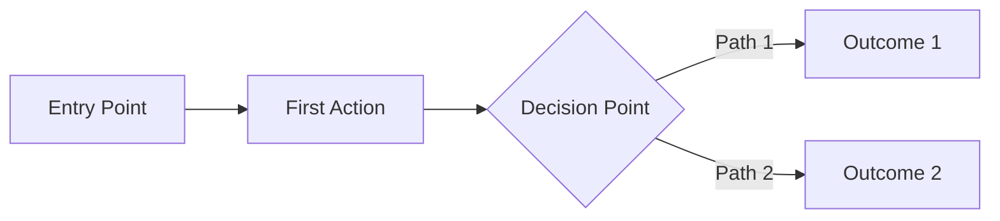

# Divine Council: UX Design Session

**Date**: [Session Date]
**Facilitator**: Zeus
**Lead Designer**: Apollo
**Participants**: [List of participants]

---

## 🎨 Session Purpose

Design the user experience and interface for [Project Name].

## 💬 Design Discussion

### Context Review - Zeus
**Zeus**: Now that we have our architecture planned, let's design how mortals will interact with our creation.

Apollo, please share your vision for the user experience.

*Zeus summons Apollo with a flash of light*

### Design Vision - Apollo
**Apollo**: *enters with artistic grace*

Greetings! I've studied our users' needs and architectural constraints. Let me paint a picture of the experience we'll create...

[Apollo presents UX vision]

### User Research Insights
[Discussion of user needs and behaviors]

### Design Collaboration
[Input from other gods on design decisions]

---

## 👥 User Personas

### Primary Persona
**Name**: [Persona Name]
- **Role**: [User role]
- **Goals**: [What they want to achieve]
- **Pain Points**: [Current frustrations]
- **Needs**: [What would help them]

### Secondary Personas
[Additional personas if relevant]

---

## 🎯 User Journeys

### Core User Flow


### Key Interaction Points
1. **Onboarding**: [First-time user experience]
2. **Core Task**: [Primary user action]
3. **Collaboration**: [Multi-user interactions]
4. **Success State**: [Achievement moments]

---

## 🎨 Design System

### Visual Principles
1. **[Principle 1]**: [Description]
2. **[Principle 2]**: [Description]
3. **[Principle 3]**: [Description]

### Color Palette
- **Primary**: [Color and usage]
- **Secondary**: [Color and usage]
- **Accent**: [Color and usage]
- **Semantic Colors**: Success, Warning, Error, Info

### Typography
- **Headings**: [Font family and sizes]
- **Body**: [Font family and sizes]
- **UI Elements**: [Font family and sizes]

### Component Patterns
- **Navigation**: [Pattern description]
- **Forms**: [Pattern description]
- **Feedback**: [Pattern description]
- **Data Display**: [Pattern description]

---

## 📱 Responsive Strategy

### Breakpoints
- **Mobile**: < 768px
- **Tablet**: 768px - 1024px
- **Desktop**: > 1024px

### Adaptation Rules
- [How layout adapts]
- [How interactions change]
- [What gets prioritized]

---

## ♿ Accessibility Plan

### WCAG 2.1 AA Compliance
- [ ] Color contrast ratios meet standards
- [ ] All interactive elements keyboard accessible
- [ ] Screen reader compatibility
- [ ] Clear focus indicators
- [ ] Proper heading hierarchy

### Inclusive Design
- [Consideration 1]
- [Consideration 2]

---

## 🎭 Microinteractions

### Feedback Animations
1. **Loading States**: [Description]
2. **Success Feedback**: [Description]
3. **Error Handling**: [Description]
4. **Transitions**: [Description]

### Performance Targets
- Animations at 60fps
- Response time < 100ms
- Loading feedback < 1s

---

## 📐 Wireframes

### [Screen Name]
```
+------------------+
|     Header       |
+------------------+
|  Nav  |  Content |
|       |          |
|       |          |
+------------------+
|     Footer       |
+------------------+
```

[Detailed wireframe descriptions]

---

## 🤝 Design Handoff

### For Developers
- Component specifications
- Interaction behaviors
- State definitions
- Animation timings

### For QA
- Test scenarios
- Edge cases
- Accessibility checklist
- Performance benchmarks

---

## 📝 Next Steps

1. [ ] Create high-fidelity mockups
2. [ ] Prototype key interactions
3. [ ] Conduct usability testing
4. [ ] Refine based on feedback
5. [ ] Prepare final specifications

---

## 🔗 Related Documents

- Discovery Session: `/chatrooms/discovery-session.md`
- Architecture Design: `/chatrooms/architecture-council.md`
- Implementation Plan: `/chatrooms/implementation-plan.md`