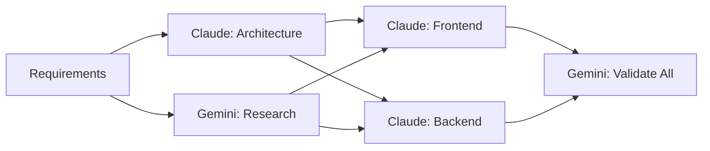

# Optimized Workflow Templates

## Quick Start Workflows

### 1. Rapid Feature Development (2-3 hours)
```bash
# Step 1: Initialize session with template
/session start --type rapid-feature --project "myapp"

# Step 2: Parallel planning (Zeus + Athena)
/gods plan feature --parallel

# Step 3: Batch validation of architecture
/batch-validate architecture --quick

# Step 4: Implementation sprint (Hephaestus)
/gods build --fast-mode

# Step 5: Batch validate all changes
/batch-validate changes --type "security,quality" --parallel

# Step 6: Quick documentation (Calliope - FREE)
/gods document --summary
```

### 2. Emergency Bug Fix (30-60 minutes)
```bash
# Step 1: Quick session
/session start --type hotfix

# Step 2: Analyze bug (Hermes for speed)
/gods analyze-bug --fast

# Step 3: Fix implementation (Hephaestus)
/gods fix --targeted

# Step 4: Focused validation
/batch-validate changes --type security --critical-only

# Step 5: Deploy check
/gods verify-fix --quick
```

### 3. Architecture Review (1-2 hours)
```bash
# Step 1: Start review session
/session start --type architecture-review

# Step 2: Gather all components
/gods map-architecture

# Step 3: Batch validate entire architecture
/batch-validate architecture --components "*" --depth deep --parallel

# Step 4: Generate report
/session export --format markdown --template architecture-report
```

## Parallel Workflow Patterns

### Pattern 1: Dual-Track Development


**Commands:**
```bash
# Terminal 1 - Claude track
/gods architect backend
/gods build backend

# Terminal 2 - Research track  
gemini "Research best practices for [feature]"

# Terminal 3 - Claude track
/gods architect frontend
/gods build frontend

# Converge for validation
/batch-validate files --list "frontend/*,backend/*" --parallel
```

### Pattern 2: Continuous Validation Pipeline
```bash
# Setup continuous validation
/workflow continuous-validation --interval 30min

# Work normally, validations trigger automatically
/gods build feature-a
# [Auto-triggers validation after 30min or significant changes]

/gods build feature-b  
# [Auto-triggers validation after 30min or significant changes]
```

### Pattern 3: Test-Driven Validation
```bash
# Step 1: Write tests first (Claude)
/gods write-tests user-auth

# Step 2: Validate test coverage (Gemini - FREE)
gemini "Validate test coverage and scenarios for: [tests]"

# Step 3: Implement to pass tests (Claude)
/gods implement user-auth --tdd

# Step 4: Batch validate implementation against tests
/batch-validate tdd --tests "test/auth/*" --implementation "src/auth/*"
```

## Cost-Optimized Workflows

### Maximum FREE Tier Usage
```bash
# 80% FREE Validation Workflow

# Planning (Claude - PAID)
/gods plan feature --minimal

# Research (Gemini Flash - FREE)
gemini "Research patterns for [feature]"

# Validation (Gemini Pro - FREE)  
gemini "Validate approach: [details]"

# Build (Claude - PAID)
/gods build --efficient

# All validation (Gemini - FREE)
/batch-validate all --comprehensive

# Documentation (Gemini Flash - FREE)
gemini "Generate documentation for: [code]"

# Cost: Only Claude creation tasks
```

### Balanced Quality-Cost Workflow
```bash
# 60% cost reduction, high quality

# Critical paths use Claude
/gods architect core-system  # Claude - PAID
/gods build critical-features # Claude - PAID

# Everything else uses Gemini
/batch-validate all          # Gemini - FREE
gemini "Document system"      # Gemini - FREE
gemini "Generate tests"       # Gemini - FREE
gemini "Review UI/UX"        # Gemini - FREE
```

## Workflow Optimization Commands

### `/workflow optimize`
Analyzes current workflow and suggests optimizations:
```bash
/workflow optimize --current-cost 10.50 --target-cost 5.00
```

Output:
```
Current workflow analysis:
- Claude usage: 70% (high)
- Gemini usage: 30% (low)
- Validation frequency: Every change (excessive)

Suggested optimizations:
1. Batch validations: Save 40% time and cost
2. Use Gemini Flash for docs: Save $2.00
3. Validate every 3 changes: Save 50% validation cost
4. Parallel execution: Save 30% time

Optimized workflow commands:
[Generated optimized command sequence]
```

### `/workflow template`
Creates custom workflow template:
```bash
/workflow template create --name "my-api-workflow" \
  --phases "design,implement,test,deploy" \
  --validation "batch,end-of-phase" \
  --cost-limit 3.00
```

### `/workflow benchmark`
Measures workflow performance:
```bash
/workflow benchmark --workflow "feature-development"
```

Output:
```
Workflow: feature-development
Duration: 2h 15m
Cost: $3.45
Validations: 12
Quality Score: 94/100
Optimization Score: B+

Recommendations:
- Batch validations: Could save 30min
- Parallel execution: Could save 45min
- Use Flash for simple tasks: Could save $0.80
```

## Advanced Optimization Techniques

### 1. Predictive Validation
```bash
# Predict what needs validation based on changes
/workflow predict-validation --changes "auth/*"

# Output: "High risk - recommend security + quality validation"
```

### 2. Smart Routing
```bash
# Automatically route to cheapest capable model
/workflow smart-route "Generate API documentation"

# Routes to Gemini Flash (FREE) instead of Claude
```

### 3. Validation Caching
```bash
# Cache validation results for unchanged files
/workflow cache-validation --ttl 24h

# Subsequent validations skip unchanged files
```

### 4. Progressive Validation
```bash
# Start with quick validation, progressively deeper
/workflow progressive-validate

# Level 1: Syntax and basic checks (30s)
# Level 2: Security and quality (2m)
# Level 3: Deep architectural review (10m)
```

## Workflow Metrics Dashboard

```bash
/workflow dashboard
```

Shows:
```
┌─────────────────────────────────────┐
│     WORKFLOW OPTIMIZATION METRICS    │
├─────────────────────────────────────┤
│ Today's Stats                        │
│ • Sessions: 3                        │
│ • Total Cost: $4.25 (-40% vs avg)   │
│ • Time Saved: 2.5 hours             │
│ • Validations: 15 (8 batched)       │
│                                      │
│ Optimization Score: A                │
│ • Batch Usage: 85% ✓                │
│ • Parallel Execution: 60% ✓         │
│ • Free Tier Usage: 75% ✓            │
│ • Cache Hit Rate: 40% →             │
│                                      │
│ Recommendations:                     │
│ 1. Increase cache usage              │
│ 2. More parallel execution           │
│ 3. Consider workflow templates       │
└─────────────────────────────────────┘
```

## Best Practices

1. **Start with templates** - Don't reinvent workflows
2. **Batch aggressively** - Single validations are inefficient  
3. **Use parallel terminals** - 3-5x speed improvement
4. **Cache validation results** - Avoid re-validating unchanged code
5. **Monitor metrics** - Track cost and time savings
6. **Optimize iteratively** - Improve workflows based on metrics
7. **Document patterns** - Share successful workflows with team